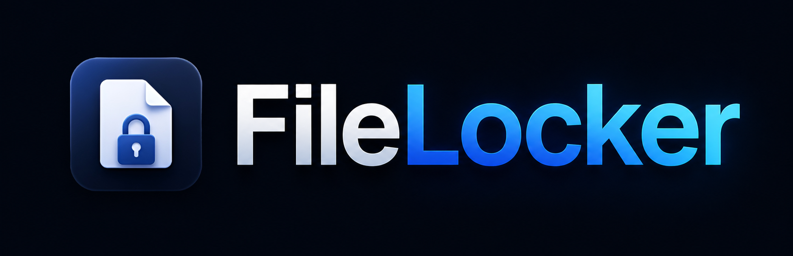
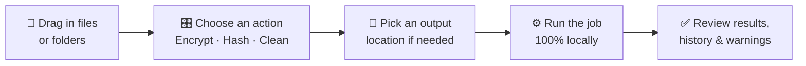
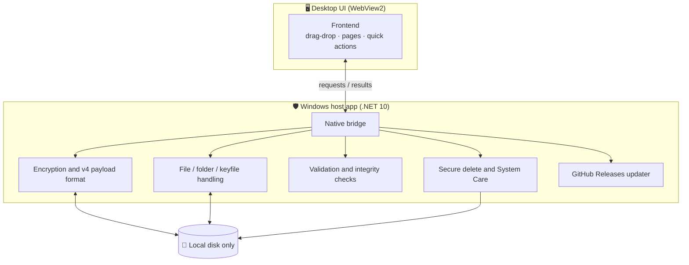

<div align="center">



### Encrypt, verify, and clean up sensitive files on Windows. Fully offline, no cloud, no account.

FileLocker is a **local-first Windows app** for **AES-256-GCM file encryption**, integrity hashing, metadata review, startup management, and secure cleanup. Drag a file in, run the job on your machine, and nothing ever leaves your device.

<br/>

[][releases]


<br/>

[**⬇️ Download the latest release**][releases] &nbsp;·&nbsp; [🐛 Report an issue][issues] &nbsp;·&nbsp; [📦 Project page][repo] &nbsp;·&nbsp; [📝 Release notes][notes-131]

<br/>

[![License][badge-license]][license]
[![Downloads][badge-downloads]][all-releases]
[![Last commit][badge-commit]][repo]
[![Open issues][badge-issues]][issues]
[![Stars][badge-stars]][repo]

</div>

---

<details>
<summary><strong>📑 Table of contents</strong></summary>

- [What FileLocker is](#what-filelocker-is)
- [Quick start](#-quick-start)
- [How it works](#-how-it-works)
- [Everything you can do](#-everything-you-can-do)
- [Folder output, without the mess](#-folder-output-without-the-mess)
- [Security, in plain English](#-security-in-plain-english)
- [Safety notes](#-safety-notes)
- [What FileLocker is and isn't](#-what-filelocker-is-and-isnt)
- [FAQ](#-faq)
- [What's new in 1.3.1.0](#-whats-new-in-1310)
- [For developers](#-for-developers)
- [Project status](#-project-status)
- [Links](#-links)

</details>

## What FileLocker Is

FileLocker is for people who want **simple, local control** over sensitive files on Windows.

You can encrypt documents and folders, decrypt them later, generate hashes to check integrity, preview the metadata a file may expose, review startup and installed apps, and securely remove files you no longer want left behind. It is designed to feel like a **desktop app first**, not a command-line utility, and not a cloud service.

> [!IMPORTANT]
> FileLocker handles files locally. Passwords, keyfiles, recovery material, update downloads, and file contents stay on your device.

**People reach for it to:**

- 🔐 Protect documents, archives, client files, or portable backups with strong local encryption.
- 🗂️ Keep encrypted copies in a separate folder instead of mixing `.locked` files back into the source.
- 🧾 Verify files with SHA-256 or SHA-512 when they want a clear fingerprint.
- 👀 Preview metadata before sharing a file with someone else.
- 🧹 Securely remove files when a normal delete isn't enough.
- ⚙️ Review startup items and installed apps without sending system details anywhere.

## 🚀 Quick Start

```text
1. Open the latest release page
2. Download FileLocker-Setup-1.3.1.0.exe
3. Run the installer wizard → launch from Start Menu
```

1. Open the [latest release page][releases].
2. Download `FileLocker-Setup-1.3.1.0.exe` (or the newest `FileLocker-Setup-{version}.exe` asset).
3. Run the setup executable and follow the wizard.
4. Launch FileLocker from the **Start Menu** or desktop shortcut.

FileLocker is a 64-bit Windows desktop app and **works offline after installation**.

> [!NOTE]
> The app uses the **Microsoft Edge WebView2 Runtime**, which most Windows 10/11 systems already have. If the window opens but the interface looks broken, install or update WebView2 and reopen FileLocker.

## 🔄 How It Works



Drag files or folders in, choose what you want to do, pick an output location if needed, run the job locally, then review the results before you move on. That's the whole loop.

## 🧰 Everything You Can Do

| Area | What it does |
| --- | --- |
| 🏠 **Dashboard** | Quick encrypt, recent activity, security status, and drag-and-drop shortcuts |
| 🔒 **Encrypt Files** | Turn files or folders into FileLocker `.locked` files |
| 🔓 **Decrypt Files** | Restore `.locked` files with the right password or recovery material |
| #️⃣ **Hash Files** | Generate SHA-256 / SHA-512 hashes and create hash manifests |
| 🔤 **Encode Text** | Convert text with Base64, URL, Hex, HTML entities, and UTF-8 tools |
| 🧾 **Metadata Scrambler** | Preview metadata fields and review what may be exposed before sharing |
| 🗑️ **Secure Delete** | Overwrite selected files where possible before removing them |
| 🧹 **Custom Clean** | Review and clean approved temp, cache, recycle bin, and log locations |
| 💽 **Partition Cleaner** | Wipe free space with Windows tools so deleted-file traces are harder to recover |
| ⚡ **Drive Optimizer** | Run Windows drive analysis and optimization from a guided page |
| 🛠️ **Registry Fixer** | Review bounded stale startup/uninstall entries with backup-first cleanup |
| 🚦 **Startup Manager** | Review startup entries and disable or restore supported items |
| 📦 **App Manager** | Review installed apps, launch visible uninstallers, and clean approved leftovers |
| ⚙️ **Settings** | Output folders, history privacy, appearance, Explorer integration, updates |
| ℹ️ **About + Security Guide** | Plain-language guidance on what FileLocker does and how to use it safely |

## 📂 Folder Output, Without the Mess

One of the nicest quality-of-life details is how folder encryption gets routed.

- Encrypt files **beside the originals** if you want to.
- Or send encrypted output to a **separate sibling folder** in the same parent directory.
- When a folder is selected, FileLocker can **suggest a cleaner output folder** automatically.
- Choose a custom destination and FileLocker can **preserve the original folder layout** inside it.

> [!TIP]
> Encrypting a large folder? Use a separate output folder such as `Folder Name (Encrypted)` to avoid filling the source tree with duplicate `.locked` files.

## 🔐 Security, in Plain English

FileLocker defaults to **AES-256-GCM** for file encryption, and can expose **ChaCha20-Poly1305** and **AES-256-GCM-SIV** for new `.locked` payloads when the local runtime supports the implementation safely. In practical terms:

- ✅ Your files are encrypted with a strong, modern AEAD cipher.
- ✅ The chosen algorithm is saved in the payload header for **automatic decryption**.
- ✅ The app can **detect tampering** before it restores output.
- ✅ A wrong password **fails safely** instead of quietly handing you damaged results.

New `.locked` files use FileLocker's **header-authenticated v4 payload format**, with explicit algorithm and key-size metadata checked against the authenticated header. Existing **AES-256-GCM v3 payloads remain decryptable**.

FileLocker also supports optional **keyfile** and **recovery key** material for people who want that workflow, but the main experience still works as a normal password-based desktop app.

> [!WARNING]
> FileLocker does **not** upload your files and has **no cloud password reset**. If you lose both the password and any recovery material, treat the protected file as inaccessible.

<details>
<summary><strong>🔬 The v4 payload format, in detail</strong></summary>

<br/>

The v4 header stores the format version, a stable payload algorithm id, the KDF id, **Argon2id** settings, chunk size, nonce prefix, and encrypted key slots.

- Each **key slot** has its own salt, nonce, and authentication tag.
- Each **payload chunk** carries its own AEAD tag, so tampering fails *before* plaintext is restored.
- v4 adds stronger metadata checks while keeping older AES-256-GCM (v3) payloads fully readable.

**PNG carrier output** uses the older AES-GCM carrier path, is only available with AES-256-GCM, and is capped at **64 MB per source file** to avoid the memory pressure of wrapping a payload inside an image. Use standard `.locked` files for larger files, or when choosing ChaCha20-Poly1305 / AES-256-GCM-SIV.

</details>

## ⚠️ Safety Notes

> [!CAUTION]
> FileLocker is **not a backup service**. If something matters, keep a backup *before* deleting originals.

- Test decryption on a **copy** before removing important source files.
- Secure delete is **best-effort** it is generally more reliable on spinning hard drives than on SSDs.
- Startup Manager **saves restore information** before disabling supported entries.
- App Manager launches vendor uninstallers **only after confirmation** and never runs silent uninstalls.
- Leftover cleanup is limited to approved **AppData / ProgramData** areas, Program Files and Windows folders are excluded from recursive cleanup.
- Some System Care actions need **administrator mode** because Windows protects those locations.
- Pair FileLocker with **full-disk encryption such as BitLocker** for stronger device-level protection.
- Metadata preview helps, but no general-purpose tool can guarantee *every* metadata field is removed from *every* file type.

## 🧭 What FileLocker Is and Isn't

| ✅ FileLocker is | ❌ FileLocker is not |
| --- | --- |
| A local file-encryption utility | A cloud storage service |
| An integrity & hashing tool | A password manager |
| A metadata preview tool | A VPN |
| A secure-delete & cleanup helper | A backup platform |
| A startup & installed-app reviewer | A replacement for full-disk encryption |

It's a focused desktop utility for **local file protection and cleanup workflows**.

## ❓ FAQ

<details>
<summary><strong>Does FileLocker send my files anywhere?</strong></summary>

No. Encryption, decryption, hashing, and cleanup all run locally. The only network calls are optional GitHub Releases checks for new signed or checksum-verified installers.
</details>

<details>
<summary><strong>What happens if I forget my password?</strong></summary>

There is no cloud reset. If you didn't set up recovery material (a recovery key or keyfile) and you lose the password, the file should be treated as permanently inaccessible.
</details>

<details>
<summary><strong>Can I open a <code>.locked</code> file on another PC?</strong></summary>

Yes, install FileLocker on the other machine and provide the correct password (and recovery material, if you used it). Files never depend on a server.
</details>

<details>
<summary><strong>Is this a replacement for BitLocker?</strong></summary>

No. BitLocker protects the whole drive; FileLocker protects individual files and folders. They work well together.
</details>

<details>
<summary><strong>Why do some cleanup actions ask for administrator mode?</strong></summary>

Windows protects certain system locations. Those specific System Care actions need elevation to read or clean them.
</details>

## 🆕 What's New in 1.3.1.0

<details>
<summary><strong>Expand the 1.3.1.0 highlights</strong></summary>

<br/>

- Fixed the updater download path so temporary `.download` files are closed before **SHA-256** verification and installer promotion.
- Rebuilt the public Windows package as `FileLocker-Setup-1.3.1.0.exe` with a matching `.sha256` sidecar for GitHub Releases.
- Kept Windows assembly, file, manifest, installer, README, updater fixture, and release-gate metadata aligned at `1.3.1.0`.
- Preserved the 1.3.0 System Care, Explorer integration, Free-Space Sanitizer, app polish, and updater surfaces while correcting the downloader failure.
- Users who saw a `.download` file access error from an older installed build should install this setup executable directly; future updater downloads use the fixed path.

📄 Full details: [1.3.1.0 release notes][notes-131] · [1.2.1.0 release notes][notes-121]

</details>

## 👩‍💻 For Developers


<details>
<summary><strong>Architecture at a glance</strong></summary>

<br/>

FileLocker keeps a strong boundary between the interface and the file-handling logic: the visible app stays easy to use, while file access, encryption, validation, update checks, and delete workflows stay inside the Windows host.



</details>

<details>
<summary><strong>Build from source</strong></summary>

<br/>

**Requirements**

- Windows 10 or Windows 11
- .NET 10 SDK
- Node.js 22 or newer
- Inno Setup 6 (only to build the public installer)
- Visual Studio 2022 with WinUI / Windows App SDK support (for the full desktop setup)

**Build the frontend and app**

```powershell
cd FileLocker\frontend
npm install
npm run build

cd ..
dotnet build .\FileLocker.csproj -c Release
```

**Run tests**

```powershell
dotnet test --project ..\FileLocker.Tests\FileLocker.Tests.csproj `
  -p:Platform=x64 -p:RuntimeIdentifier=win-x64 `
  -p:SelfContained=true -p:SkipFrontendBuild=true
```

**Build the Inno Setup installer**

```powershell
cd ..
.\scripts\Build-InnoInstaller.ps1 -Configuration Release -RuntimeIdentifier win-x64
```

The installer flow publishes the app into a clean staging folder, compiles `installer\inno\FileLocker.iss`, and writes `FileLocker-Setup-1.3.1.0.exe` plus `FileLocker-Setup-1.3.1.0.exe.sha256` to `artifacts\inno`.

</details>

<details>
<summary><strong>See the deeper toolset</strong></summary>

<br/>

- Optional custom encrypt/decrypt output folders
- Suggested sibling output folders for folder-based encryption
- Compression before encryption
- Output-name scrambling
- Optional PNG carrier output
- Folder packaging mode
- Recovery key and keyfile support
- Hash manifest generation
- Explorer right-click integration
- Local history with privacy modes and redacted exports
- Startup entry review with reversible disable
- Installed app inventory and visible uninstaller launch
- Approved app leftover cleanup for AppData and ProgramData
- GitHub Releases update checks with setup-installer checksum verification

</details>

## 📈 Project Status

[](https://star-history.com/#jeremymhayes/FileLocker&Date)

If FileLocker is useful to you, a ⭐ on the [repository][repo] helps other people find it.

## 🔗 Links

| | |
| --- | --- |
| ⬇️ [Latest release][releases] | 📦 [All releases][all-releases] |
| 🐛 [Issue tracker][issues] | 💻 [Repository][repo] |
| 📝 [1.3.1.0 release notes][notes-131] | 📝 [1.2.1.0 release notes][notes-121] |

**Project documents:** [License][license] · [Security policy][security] · [Contributing][contributing] · [Support][support] · [Code of conduct][coc]

---

<div align="center">

**FileLocker**, local-first file protection for Windows. No cloud. No account. Just your files, on your machine.

</div>

<!-- Reference-style links (edit URLs in one place) -->
[releases]: https://github.com/jeremymhayes/FileLocker/releases/latest
[all-releases]: https://github.com/jeremymhayes/FileLocker/releases
[issues]: https://github.com/jeremymhayes/FileLocker/issues
[repo]: https://github.com/jeremymhayes/FileLocker
[notes-131]: https://github.com/jeremymhayes/FileLocker/releases/tag/v1.3.1.0
[notes-121]: https://github.com/jeremymhayes/FileLocker/releases/tag/v1.2.1.0
[license]: LICENSE
[security]: SECURITY.md
[contributing]: CONTRIBUTING.md
[support]: SUPPORT.md
[coc]: CODE_OF_CONDUCT.md

<!-- Status badges (auto-updating from the repo) -->
[badge-license]: https://img.shields.io/github/license/jeremymhayes/FileLocker?style=flat-square&color=64748B
[badge-downloads]: https://img.shields.io/github/downloads/jeremymhayes/FileLocker/total?style=flat-square&logo=github&label=downloads
[badge-commit]: https://img.shields.io/github/last-commit/jeremymhayes/FileLocker?style=flat-square&color=64748B
[badge-issues]: https://img.shields.io/github/issues/jeremymhayes/FileLocker?style=flat-square&color=64748B
[badge-stars]: https://img.shields.io/github/stars/jeremymhayes/FileLocker?style=flat-square&color=F59E0B
